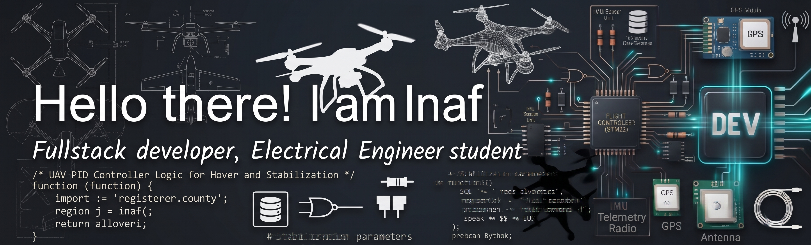

  

  
  
  

---

### 🚀 About Me

- 🔭 Currently working with the **Espyro Team**, building a fixed-wing UAV (drone).
- 🌱 Actively learning **C** and **Lua**.
- 🎯 Focused on embedded systems, UAV development, and web programming.
- 📊 Experienced in analyzing UAV flight logs with **Mission Planner** (ArduPilot) — tuning, telemetry review, and post-flight diagnostics.
- 💬 Ask me about flight controllers, embedded C, or web dev with PHP/JS.
- ⚡ Fun fact: I like combining low-level firmware work with high-level web tooling.

---

### 🛠️ Tech Stack

  
  
  
   
  
  
  
  
   
  
  
   
  
  

---

<!--
### 📌 More Projects
- **[Project Name](repo-link)** — one-line description of what it does and the stack used.
- **[Project Name](repo-link)** — one-line description of what it does and the stack used.
-->

---

### 📈 GitHub Stats

  
  

  

---

### 🔗 Connect with Me

  
  

---

  

